# media-bank

Table of content:
* ⚙️ [Prerequists](#prerequists)
* 📐 [Conception](#conception)
* 🚀 [Usage](#usage)
* 🏟️ [Hosting](#hosting)
* 👨🏻‍💻 [Development](#development)
    * [Types](#types)
    * [Response](#response)
    * [Object](#oop)
    * [Structures](#structures)
    * [Routing](#routing)
    * [Template](#template)
    * [Globals](#globals)
    * [XSS](#xss)
    * [Data access](#dataaccess)
    * [Session](#session)
    * [CSRF](#csrf)
    * [Side Effect](#sideeffect)
    * [API](#api)
    * [Cache](#cache)

___

<a id="prerequists"></a>

## ⚙️ Prerequists

### ☑️ IDE

Make your choice:

* Eclipse: [https://www.eclipse.org/downloads/download.php?file=/oomph/epp/2020-03/R/eclipse-inst-win64.exe](https://www.eclipse.org/downloads/download.php?file=/oomph/epp/2020-03/R/eclipse-inst-win64.exe)

* PHPStorm: [https://www.jetbrains.com/fr-fr/phpstorm/download/#section=windows)

### ☑️ PHP Distribution

PHP 7.4.3 with XAMPP: [https://www.apachefriends.org/download.html](https://www.apachefriends.org/download.html)

* Run server

```bash
php -S localhost:8000
```

* Run server in a specific dir

```bash
php -S localhost:8000 -t public/
```

### ☑️ Package manager

**Composer**

*Window*: https://getcomposer.org/Composer-Setup.exe

*Other*: https://getcomposer.org/installer

* Execute 

```bash
composer
```

* Execute locally

```bash
php composer.phar
```

* Declare a project

```bash
composer init 
```

> File *composer.json*  describe the project

* Install dependencies

```bash
composer install
```

* Install a package

```bash
composer require vendor/package-name
```

* Generate autoload

```bash
composer dump-autoload
```

> Packages are avalaible on: [https://packagist.org/](https://packagist.org/)

### ☑️ Migration

Execute  script:
* [serie-bank.sql](serie-bank.sql)

### ☑️ Skeleton

#### Coding style:

* PSR-1: [https://www.php-fig.org/psr/psr-1/](https://www.php-fig.org/psr/psr-1/)

* PSR-2: [https://www.php-fig.org/psr/psr-2/](https://www.php-fig.org/psr/psr-2/)

#### Folders

* **config/** : configuration files
> File use json, xml or yml extension

* **public/**: web server files
    * **index.php**: entry point
> Handle all HTTP requests

* **src/** : PHP source code
> Contain classes

* **templates/**: HTML view files
> Contain views

* **uml/**: MDJ, JPG diagrams
> Contain diagrams
___

<a id="conception"></a>

## 📐 Conception

### ✔️ Use Cases

*Authentification*

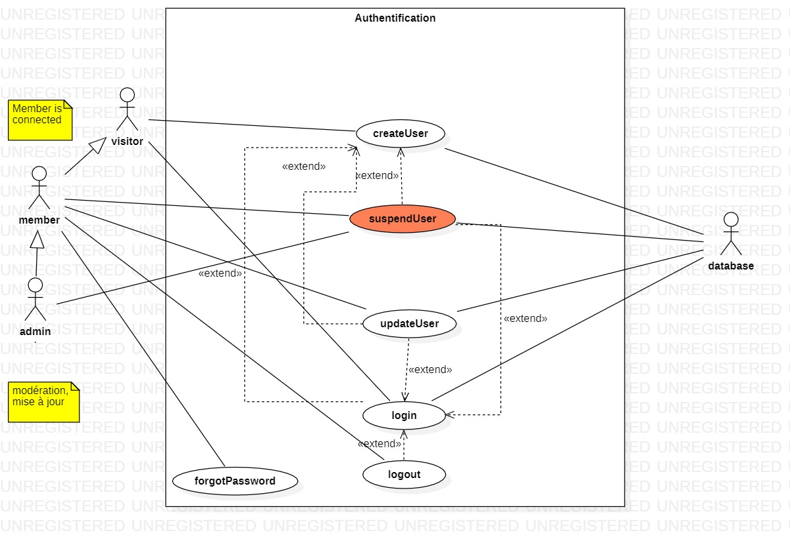

*Media item*

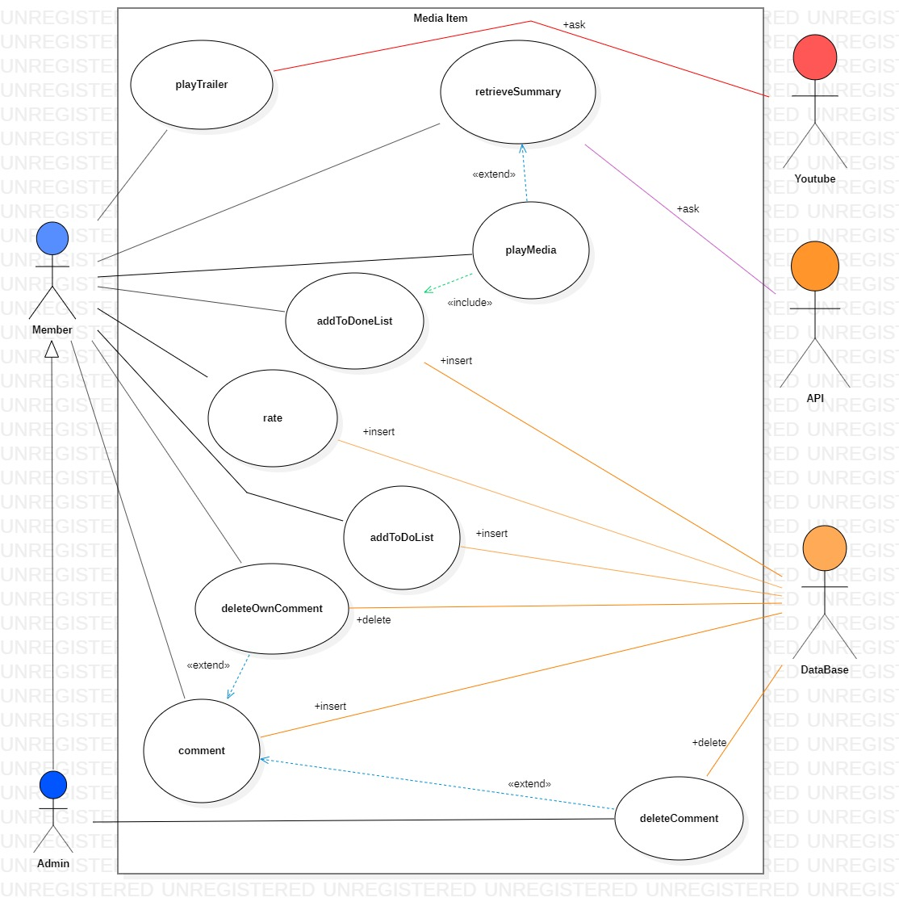

### ✔️ Package

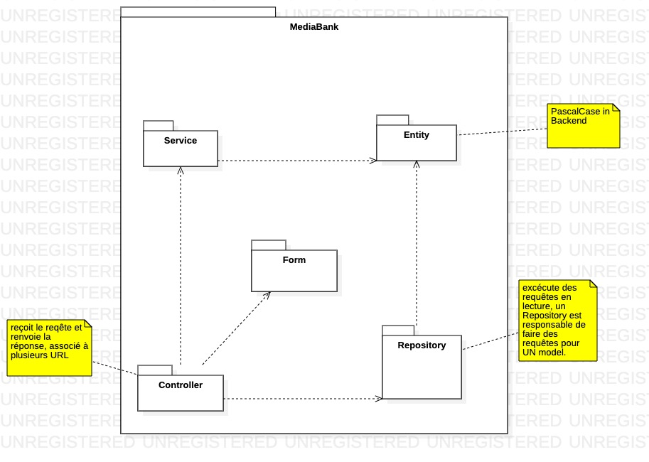

### ✔️ Class

*Entity*

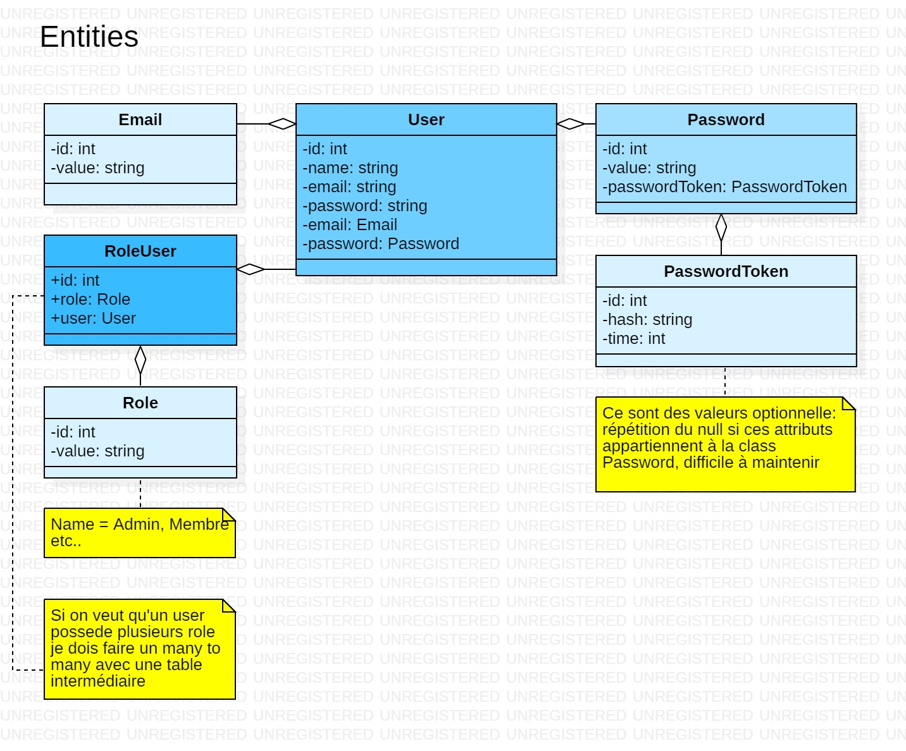

*Controller*

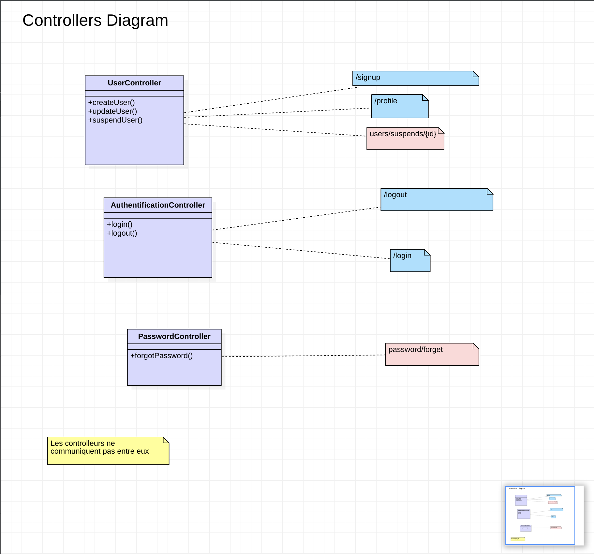

### ✔️ Sequence

*Create user*

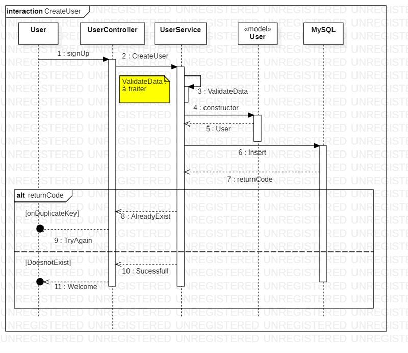

*Update user*

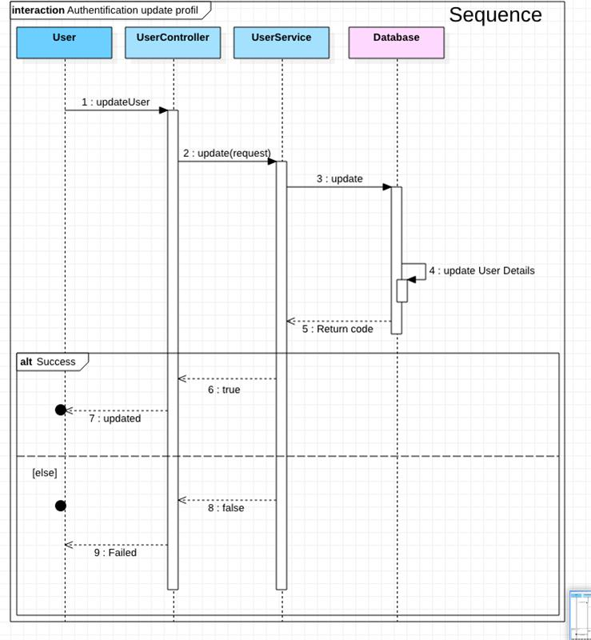

*Login*

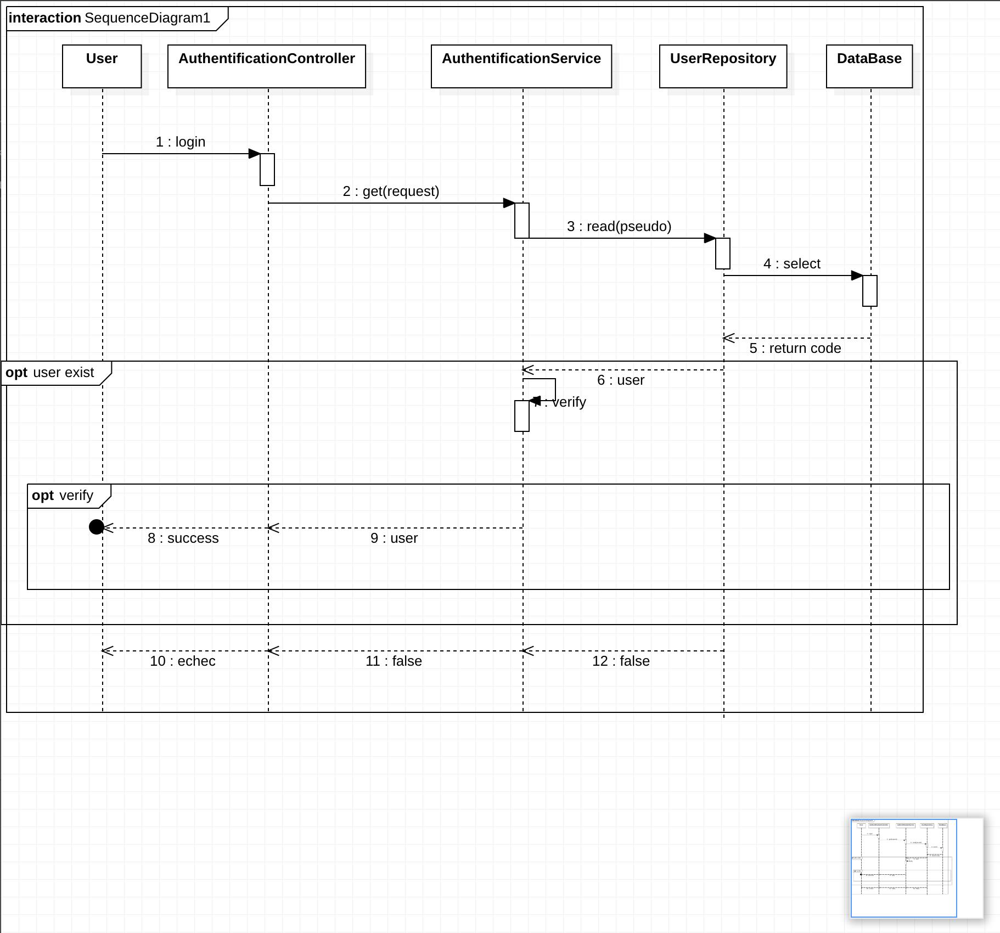

*Logout*

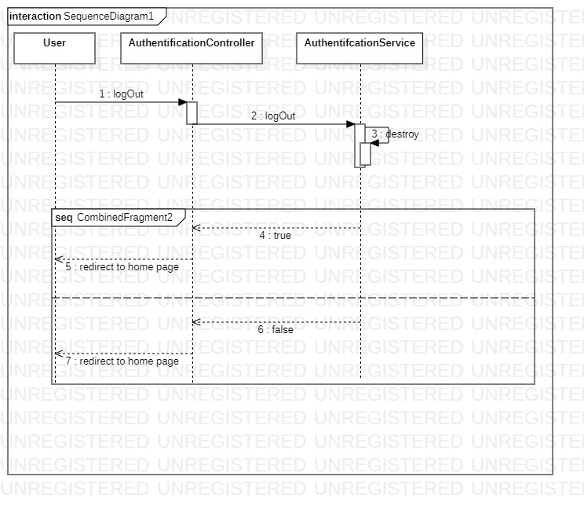

*Suspend user*

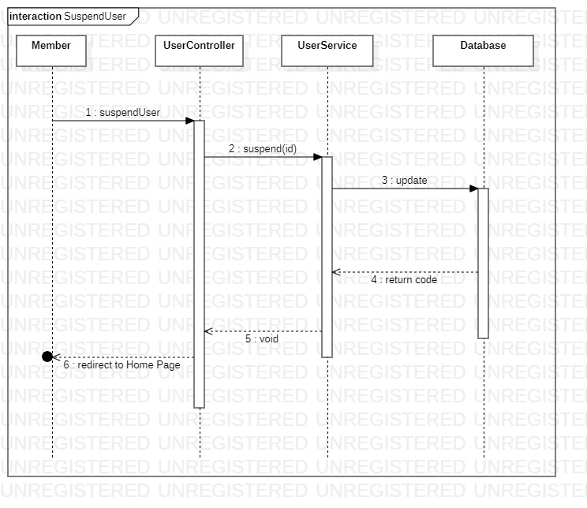

*Forgot password*

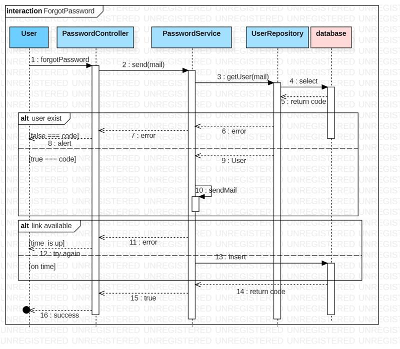

### ❌ Activity

### ✔️ Component

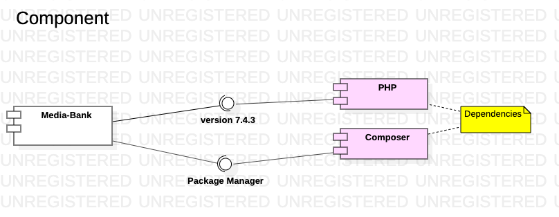

### ✔️ Deployment

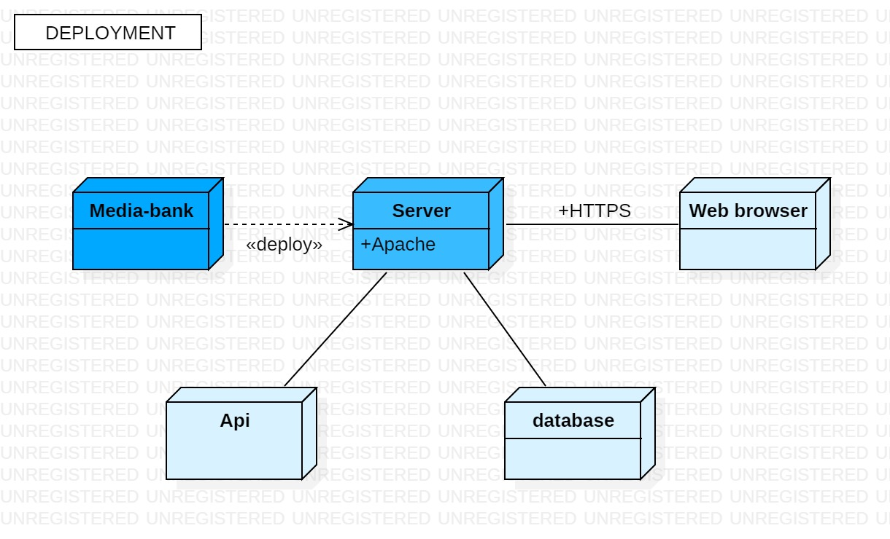

___

<a id="usage"></a>

## 🚀 Usage

### ☑️ Run

* Generate autoloader

```bash
composer dump-autoload
```

* Run server in public

```bash
php -S localhost:8000 -t public
```

* Open your web browser at: [http://localhost:8000](http://localhost:8000)

___

<a id="hosting"></a>

## 🏟️ Hosting

[AlwaysData](https://www.alwaysdata.com/fr/)

> Create an account, this gives you access to a disk space, a domain name and a database.

Account informations:
* ☑️ username
* ☑️ password
* ☑️ url du site

FTP informations:
* ☑️ host
* ☑️ port
* ☑️ username
* ☑️ password

FTP client:
* FileZilla: [https://filezilla-project.org/](https://filezilla-project.org/)

BDD information:
* ☑️ name
* ☑️ port
* ☑️ username
* ☑️ password


### ⚠️ Deployment problem

**URL not Found**

The server does not authorize URLs, xampp have same comportment.

✔️ **Allow URLs**

* You must place a *.htaccess* at the root of public

*.htaccess*

```bash
# Deny access to the .htaccess file and will trigger a 403 status code
<Files .htaccess>
    order allow,deny
    deny from all
</Files>
#Use index.php for project entry point
DirectoryIndex index.php
#Turn RewriteEngine to On
RewriteEngine On
#Deliver static file
RewriteCond %{REQUEST_FILENAME} -f
RewriteRule ^ - [L]
#Trigger index.php and add query string append flag
RewriteRule ^(.*)$ index.php [QSA,L]
```
___

<a id="development"></a>

## 👨🏻‍💻 Developement

___

<a id="types"></a>

### ✔️ Types
Type void and resource are not represented:
```php
/** @var null */
$foo = null;

/** @var int */
$foo = 33;

/**@var float */
$foo = 33 / 33;

/**@var bool */
$foo = true;

/**@var string */
$foo = "Hello";

/** @var array */
$foo = [];

/** @var stdClass */
$foo = new stdClass();
```
Var identifier can be dynamic:
```php
$foo = "bar";
$$foo = "baz";
echo $bar; //baz
```
___

<a id="response"></a>

### ✔️ Response
Send header and body:
```php
//Protocol and status
header("HTTP/1.1 404 TOTO");
//Add header
header("Content-Type: text/html");
//Add Body content
echo "Hello World";
//Import a file and add content to body
include "./foo.html";
```
___

<a id="oop"></a>

### ✔️ Object Oriented Programming

The procedure describe how to instanciate a class with PHP.

* Specify your **vendor** name for your **src** folder

*composer.json*
```json
"autoload": {
    "psr-4": {
        "App\\": "src/"
    }
}
```

* Generate the autoloader

```bash
composer dump-autoload
```

* Require the autoloader

*index.php*
```php
require "./../vendor/autoload.php"
```
___

<a id="structures"></a>

### ✔️ Structures

* if else

```php
if () {
} elseif () {
} else {
}
```

* foreach

```php
foreach ($myArray as $key => $value) {
}
```
* try catch

```php
try {
    echo "Always executed";
    $dbh = new PDO;
    echo "Never executed";
} catch (Throwable $e) {
    echo "Catched";
}
```
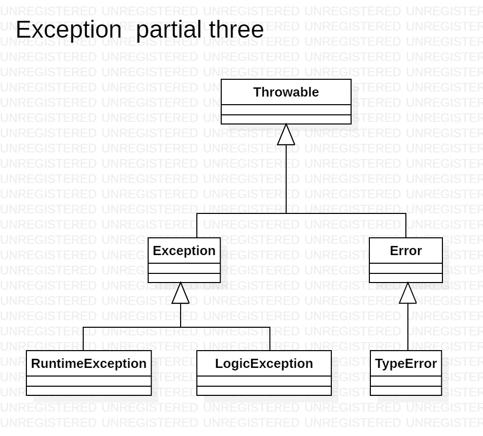

___

<a id="routing"></a>

### ✔️ Routing

Requests are handle by one file: "index.php".
An URL is associated to a method of a controller.

*index.php*
```php
<?php

require '../vendor/autoload.php';

$url = "/";
if (array_key_exists("REDIRECT_URL", $_SERVER)) {
    $url = $_SERVER["REDIRECT_URL"];
} else if (array_key_exists("PATH_INFO", $_SERVER)) {
    $url = $_SERVER["PATH_INFO"];
}

$routes = [
    "/login" => [
        "controller" => "App\Controller\AuthentificationController",
        "method" => "login"
    ]
];

foreach ($routes as $key => $value) {
    if ($url === $key) {
        $className = $value["controller"];
        $obj = new $className;
        $methodName = $value["method"];
        $obj->$methodName();
    }
}

```
**👨🏻‍💻 Manipulation**

With the **if** and the **try catch**:

* Propose a 404 page if no route matches

* Propose a page "site under maintenance" if a Throwable has been throwed

⚠️Problems:

We need to enforce routing for dynamic URL.

___

<a id="template"></a>

### ✔️ Template

**👨🏻‍💻 Manipulation**

For "/ login" and "/ signup"
You must display a login and account creation page.

These pages or parts of pages, reside in the "templates" folder, the controller must include them.
 
These files must have the extension ".html.php".

For HTML creation, copy and paste bootstrap documentation.
 
⚠️Problems:

* **Include path**: all relative paths are relative to the execution point (index.php), path maintenance problem

* **reutilisation des éléments communs**: we repeat html, head, body
 
✔️ Solutions:

* **Include path**: be able to start the path from the current directory.
```php
include __DIR__ . "/../../templates/foo.html.php";

```

* **reusability**: create a header and footer file to include on each page.

```bash
templates
|- authentification
|_| - template.html.php
|- _header.html.php
|- _footer.html.php
```

___

<a id="globals"></a>

### ❌ Globals
___

<a id="xss"></a>

### ❌ XSS
___

<a id="dataaccess"></a>

### ❌ Data access
___

<a id="session"></a>

### ❌ Session
___

<a id="csrf"></a>

### ❌ CSRF
___

<a id="sideeffect"></a>

### ❌ Side Effect
___

<a id="api"></a>

### ❌ API
___

<a id="cache"></a>

### ❌ Cache
___


