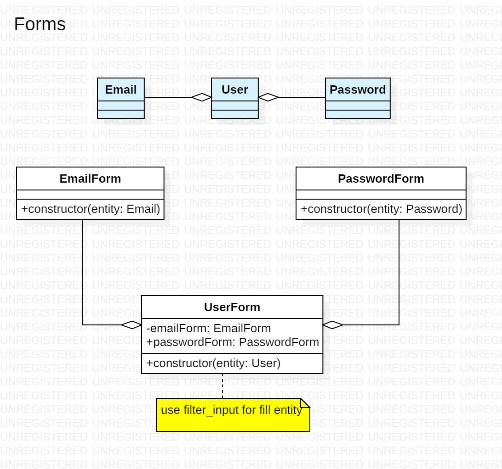

# 🎓  TP - PHP S1

You have 7 hours to realize the following case.

**You will be evaluated on your ability to meet the following 📝 functional goals.**

___

## 🖊️ `Forms`

**You have to define `Forms responsabilities`.**

🦢 You need to **propose methods and refactor** your Forms: stop to use constructor for something else that attributes intialization.

* 📝 Provide method to fill entity with request
* 📝 Provide method to know if form is submit
* 📝 Provide method to know if form is valid

@see naming: https://symfony.com/doc/current/forms.html#processing-forms

### 🙍‍♂️ `/signup`

**You have to `display view errors`.**

🦆 Use **bootstrap alert component** in "/signup" form and display errors for following cases:

* 📝 Empty input
* 📝 Pseudo is shorter than 3 caracteres
* 📝 Pseudo is longer than 12 caracteres
* 📝 Email is not a valid email
* 📝 Password is shorter than 6 caracteres
* 📝 Password is longer than 24 caracteres
* 📝 Confirmation and password are differents

🙈 Validation filter: https://www.php.net/manual/en/filter.filters.validate.php

🙈 String length: https://www.php.net/manual/fr/function.strlen.php

🙊 In an other context you will use PasswordForm for password validation without confirmation input. Provide confirmation error only if is present!

### 👪 `/login`

**You have to `display view errors`.**

🦆 Use **bootstrap gride, forms and alert component** in "/login" to display page, form and display errors for following cases:

* 📝 Empty input
* 📝 Email is not a valid email

Use Bootstrap properly:

* 📝 Elements must be dimensioned
* 📝 Elements must be positionned 

### 🔍 `/search`

**You have to `display search pattern`.**

🦆 Use **bootstrap gride, forms and alert component** in "/search" to display page and form:

* 📝 "/search" must display a page
* 📝 Use a Form and the GET method
* 📝 For empty input the search bar must be centred in the page
* 📝 For filled input the search bar must be at the top of the page
* 📝 For filled input the search pattern must be displayed

### 🧭 Navigation

**You have to `provide a navigation`**.

🦆 Use **bootstrap NaBar** in "/", /"signup", "/login" and "/search" for a navigation:

* 📝 Navigation provide links
* 📝 The current nav item must have the class "active"

___

##  🛢️ Database

**You have to `create your database scheme`.**

🦢 You need to **create database and tables** : using your entity diagram, create tables in relations.

* 📝 Tables must be in relation
* 📝 Use snake_case a naming convention 

🐬 You need to **create a migration script** executable in a terminal.

* 📝 config/migration.php must deploy your database and tables 
* 📝 Green message must be visible at deployment success
* 📝 Red message must be visible at deployment fail

🙈 PDO construction: https://www.php.net/manual/en/pdo.construct.php

🙈 PDO prepare: https://www.php.net/manual/fr/pdo.prepare.php

🙈 PDO execute: https://www.php.net/manual/fr/pdostatement.execute.php

___

## 🕕 Manage your time

You need to enforce your Oriented Object Programation skill and play with Bootstrap

## 🎯 Let's focus
